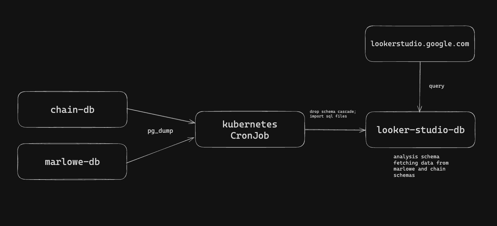

Data Replication Cronjob
===============

This project is meant to enable Kubernetes to run batchs for replicating data from multiple RDS instances to the one used by Google Looker Studio for data analysis. Please note that all these resources were imperatively added as it's a self contained work and we don't have interest in maintaining it integrated to our platform codebase.

It follows this architecture:




Building image
---------------

To build the image we just need `docker` running in local machine and `awscli` properly configured with a profile named *dapps-world*. Then, we just need to run the `buildAndPush.sh` script and everything will happen automatically. 

Additional Tips:
1. Make sure Docker has experimental features enabled for multi-platform builds;
2. It will push an image tagged with a `date` pattern, the pattern is "%Y%m%d" (For example: "20240117"), you have to update `datasync.yaml` with the correct image tag;

Deploying the CronJob
---------------

Once the image is built and datasync.yaml is updated accordingly, you just have to decrypt the secrets for the LookerDB instance and create the resources in Kubernetes by running these commands:

```shell
# Decrypting LookerDB instance credentials
sops --aws-profile dapps-world \
--kms arn:aws:kms:us-east-1:677160962006:key/fa4d1d08-ad00-4014-97d2-5ff14e00e1b1 \
-d secret.enc.yaml > secret.yaml

# Applying secrets and Datasync resources (pvc and cronjob)
kubectl apply -f secret.yaml
kubectl apply -f datasync.yaml

# Removing plaintext secrets.yaml (It shouldn't be commited)
rm -f secret.yaml
```
